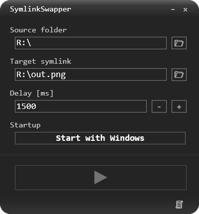

#  SymlinkSwapper
**Technology:** WPF, net5.0, WinAPI Interoperability

**Description:** SymlinkSwapper allows for automatic periodical creation of a symbolic link.
The symbolic link gets recreated at a user-defined interval, and it points to each of the files in the user-defined directory, one by one.

**Usage example:**

**Screenshots:**

